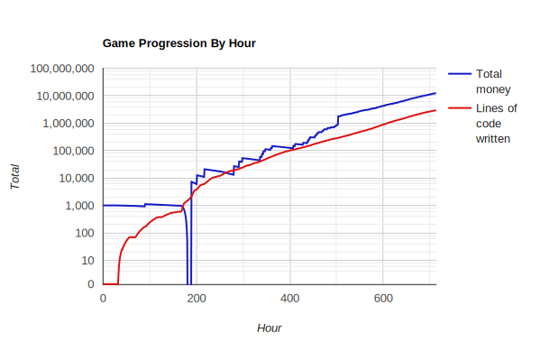
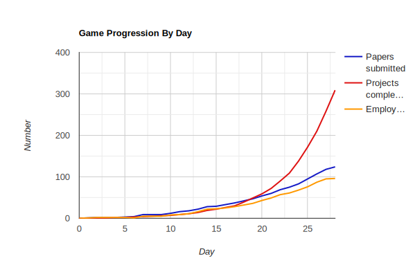

# Your Website Here
Your Website Here is a game where you take on the role of a website company manager. The game is available [**here**](https://danielchandg.github.io/YourWebsiteHere/). The objective of the game is to expand your company by hiring developers, building websites, and gaining rewards. The game was made using React + Material UI.

## Short Gameplay Loops
Your Website Here has several short gameplay loops that offer immediate feedback to the player.
1. In the tutorial, the player is introduced to the core mechanics of the game. The player is guided through the process of hiring and approving employees. The player is introduced to the company's projects. Lastly, the tutorial transitions to the gameplay experience of expanding the company by hiring more employees.
2. To hire an employee, the player first submits a request, then approve the employee's application. At any point, the player can choose to fire an employee. Lastly, random events occur periodically that can cause the employee to be promoted or leave the company.
3. The player is presented with the current project and a list of upcoming projects. The player can view the requirements and reward of each project. The player can choose to reject an upcoming project at any time. Lastly, there are many different possible rewards for projects.

## Long Gameplay Loops
The long gameplay loops relate to the expansion of the company based on the player's actions.
1. The company workforce is constantly evolving. Over time, employees are hired, fired, or promoted. As the company grows, the number of employees increases linearly while the productivity of employees increases exponentially.
2. As the workforce evolves, they are able to tackle larger projects and complete projects quicker. The requirements and rewards of projects grows exponentially over time. Special projects offer different rewards, even including unlocking new projects.

## Graphs
In the first graph, we have total money and total number of lines of code by hour. The y-axis is logarithmic. We see an initial drop-off in money, then both metrics increase exponentially. This makes sense since most startup companies usually need to borrow money before they become profitable.

In the second graph, we have total number of papers submitted, projects completed, and employees hired by day. Each of the three metrics seems to be growing exponentially. However, note the player must hire employees or submit papers themselves, thus these two metrics do not grow exponentially.

